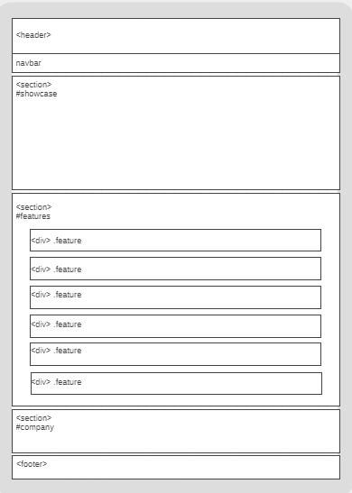

# Development Strategy

> `App Theme`

## Description
This is HTML5 CSS3 template using FlexboxGrid framework.
It could be used like an example of responsive web site development.

## Wireframes (index page)

<!-- include a wireframe for your project in this repository, and display it here -->
<!-- wireframe.cc is a good site for getting started with wireframes -->
* For small displays <= 500px: 


* For medium and large displays:


## 0. Set-Up

__A User can see my initial repository and live demo__

### Repo

- Generated from Template
- GitHub Pages turned one
- Write initial, basic README


## 1. Creating folder structure

> On this step site file structure was set including css files for FlexboxGrid and Fontawesome frameworks.

### Repo
* Branch: 
```initial```

### Common
Setting folder structure, adding FlexboxGrid and Fontawesome styles files.

### HTML

Setting links to css files

### CSS

No css development on this step

## 2. Setting Index page html markup and initial styling

### Common
On this step user can see index.html page developed with basic Flexboxgrid styling 

### Repo

* Branch: 
```index-html-css-markup```
### HTML

HTML markup structure of index.html is developed.  

### CSS
* Flexboxgrid framework classes are implemented
* Main styling rules are implemented (typography, common elements)

## 3. Setting About page html markup and initial styling

### Common
On this step user can see about.html page developed with basic Flexboxgrid styling 

### Repo

* Branch: 
```about-html-css-markup```
### HTML

HTML markup structure of about.html is developed.  

### CSS
* Flexboxgrid framework classes are implemented

## 4. Setting Contacts page html markup and initial styling

### Common
On this step user can see contacts.html page developed with basic Flexboxgrid styling 

### Repo

* Branch: 
```contacts-html-css-markup```
### HTML

HTML markup structure of contacts.html is developed.  

### CSS
* Flexboxgrid framework classes are implemented

## 5. Setting Services page html markup and initial styling

### Common
On this step user can see servicies.html page developed with basic Flexboxgrid styling 

### Repo

* Branch: 
```services-html-css-markup```
### HTML

HTML markup structure of services.html is developed.  

### CSS
* Flexboxgrid framework classes are implemented

## 6. CSS styling of index.html

### Common
On this step user can see index page fully developed with according to the page layout and responsive page concept.  

### Repo

* Branch: 
```css-index```
### HTML

Some details were fixed to match accepted page layout. 

### CSS
* CSS rules are implemented to the elements of index.html
* Necessary media queries are implemented to meet responsive design rules.


## 7. CSS development of about, services and contacts pages

### Common
On this step user can see all other pages fully developed according to the page layout and responsive page concept.  

### Repo

* Branch: 
```css-rest-pages```
### HTML
No changes on this step
### CSS
* CSS rules are implemented to the elements of about, contacts and services.html


## Finishing Touches
* Obvious bugs were found
* W3C code validation made
* README file completed

### Branch: 
* Branches: ```bugfix```
* Branch: ```readme```
